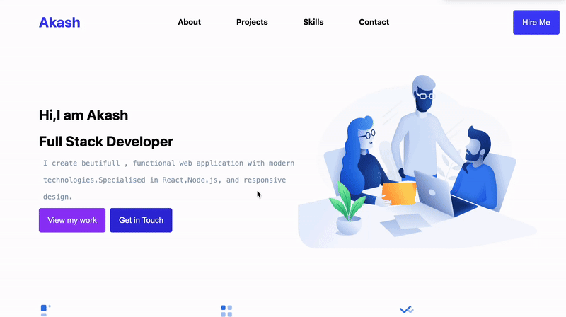

<h1 align="center">🌐 OSW_01 — Personal Portfolio</h1>

<p align="center">
  
</p>

<p align="center">
  
  
  
  
  
</p>

---

## 🎥 Portfolio Demo

<p align="center">
  
</p>

---

## 🚀 Live Website

👉 **Explore the Portfolio Here:**  
🔗 **https://osw-01-62rm.vercel.app/**

> 💡 _A portfolio is more than a website — it's your digital identity._

---

## 🧠 Project Overview

**OSW_01** is a modern, responsive personal portfolio crafted to showcase skills, projects, and services with clarity and style.

Built with a strong focus on **performance, simplicity, and user experience**, this project reflects my dedication to writing clean code and designing intuitive interfaces.

✨ Perfect for creating a powerful first impression on recruiters and collaborators.

---

## ✨ Highlight Features

🚀 Fully responsive across all screen sizes  
🎨 Clean, modern, and professional interface  
⚡ Fast-loading and lightweight structure  
🧭 Smooth navigation with structured sections  
🧩 Services section (Web Dev, UI/UX, Backend)  
📂 Project showcase  
🌐 Social media integration  
🛠️ Built using modern layout practices

---

## 🛠️ Tech Stack

<p align="center">


</p>

| Technology     | Role               |
| -------------- | ------------------ |
| **HTML5**      | Semantic structure |
| **CSS3**       | Styling & layout   |
| **Flexbox**    | Responsive design  |
| **Modern CSS** | Enhanced UI        |

---

## 📁 Project Structure

```
osw_01/
│
├── index.html
├── style.css
├── images/
│   ├── email icon.png
│   ├── Github icon.png
│   ├── Linkden icon.png
│   ├── Image 1.png
│   ├── Image 2.png
│   ├── Image 3.png
│   ├── preview 1.png
│   ├── preview 2.png
│   └── OSW_1-demo.gif
```

---

## 🎯 Purpose of This Project

This portfolio was created to:

✅ Apply real-world development concepts  
✅ Strengthen core HTML & CSS skills  
✅ Master layout design techniques  
✅ Build a strong developer presence  
✅ Showcase projects professionally

---

<!--
## 📸 Preview

<p align="center">
  <br><br><br>
  
</p> -->

---

## ⚡ Run Locally

Clone the repository:

```bash
git clone https://github.com/Akash-Wakade-7008-alt/Osw_01.git
```

Navigate into the folder:

```bash
cd Osw_01
```

Open **index.html** — and you're ready to go ✅

---

## 🔥 Future Enhancements

🌙 Dark mode support  
🎬 Advanced animations  
⚙️ JavaScript-powered interactivity  
📈 Performance optimization  
♿ Accessibility improvements  
📦 Expanded project section

---

## 👨‍💻 Author

### **Akash Wakade**

💡 Passionate about building responsive websites, clean UI, and real-world web projects.

> ⭐ If you like this project, consider giving it a star — it truly supports my journey!

---

## 📬 Connect With Me

🔗 **GitHub**  
https://github.com/Akash-Wakade-7008-alt

🔗 **LinkedIn**  
https://www.linkedin.com/in/akash-wakade-08b8412b2/

📧 **Email**  
akashwakade7355@gmail.com

---

<p align="center">
  ⭐ <strong>"First impressions matter — your portfolio is your digital handshake."</strong>
</p>

<!--
## 🎥 Live Preview

<p align="center">
  
</p> -->
