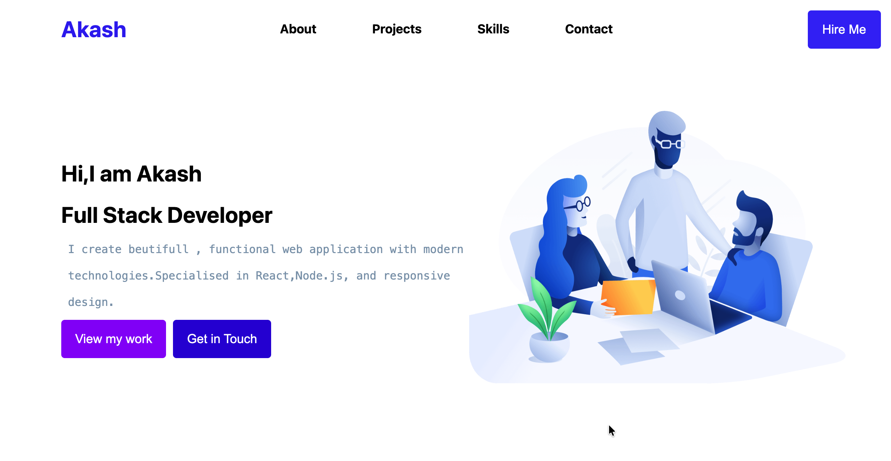
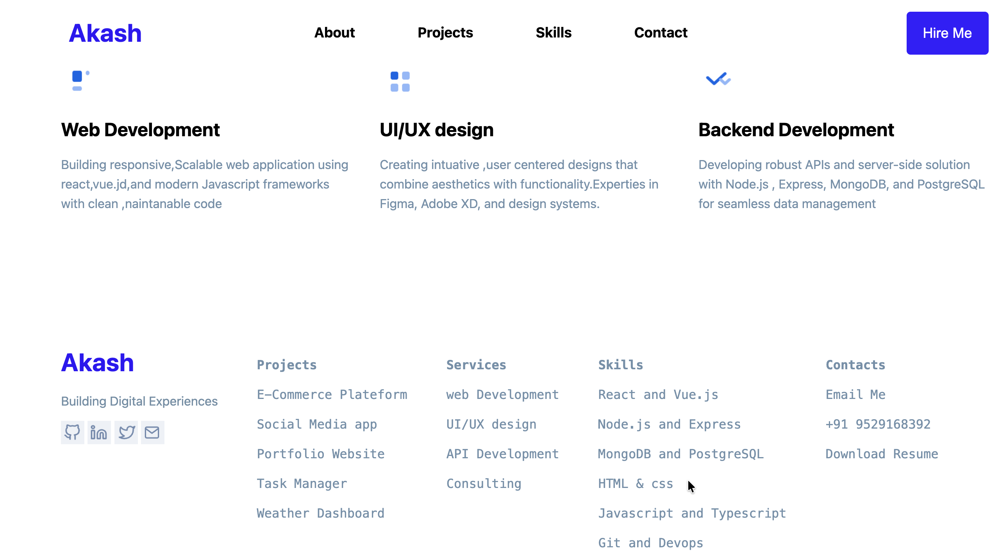

<!-- Vercel link
https://osw-01-nine.vercel.app/ -->

# 🌐 OSW_01 — Personal Portfolio Website

A modern and responsive **Personal Portfolio Website** built using **HTML and CSS**.  
This project showcases my skills, services, and projects in a clean and visually appealing layout.

🚀 Designed to create a strong first impression for recruiters and collaborators.

---

## ✨ Features

✅ Fully responsive design  
✅ Clean and modern UI  
✅ Smooth layout with structured sections  
✅ Services section (Web Dev, UI/UX, Backend)  
✅ Project highlights  
✅ Contact section with social links  
✅ Beginner-friendly and lightweight

---

## 🛠️ Built With

- **HTML5** — Structure
- **CSS3** — Styling & Layout
- **Flexbox / Modern CSS** — Responsive design

---

## 📂 Project Structure

osw_01/ 
│ 
├── index.html 
├── style.css 
└── images/ 
├── email icon.png 
├── Github icon.png 
├── Linkden icon.png 
├── Image 1.png 
├── Image 2.png 
├── Image 3.png 
├── preview 1.png 
└── preview 2.png 

---

## 🎯 Purpose of This Project

This portfolio was created to:

- Practice real-world web development
- Strengthen HTML & CSS fundamentals
- Understand layout design
- Build a developer presence online

---

## 🌍 Live Demo

🚀 **Visit Here:**  
👉 https://osw-01-62rm.vercel.app/

---

## 📸 Preview

     
  

---

## 🚀 How to Run Locally

1. Clone the repository:

git clone https://github.com/Akash-Wakade-7008-alt/Osw_01.git

2. Open the folder.

3. Double click **index.html**

Done ✅

---

## 🔥 Future Improvements

- Add JavaScript for interactivity
- Improve animations
- Deploy live version
- Add dark mode
- Optimize for performance

---

## 👨‍💻 Author

**Akash Wakade**

If you like this project, consider giving it a ⭐ on GitHub!

---

## 📬 Connect With Me

- GitHub : https://github.com/Akash-Wakade-7008-alt
- LinkedIn :in/akash-wakade-08b8412b2
- Email : akashwakade7355@gmail.com
